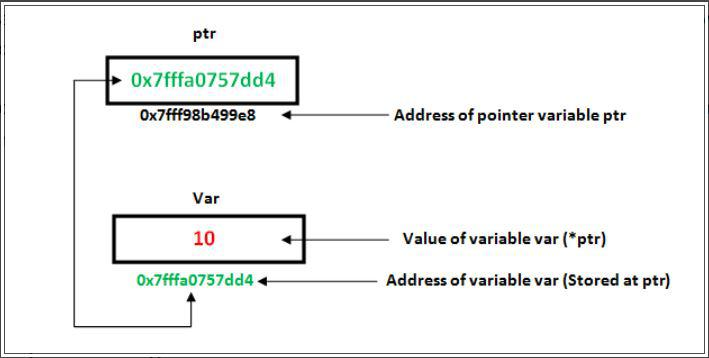

# Lý thuyết con trỏ và mảng 1 chiều

## A. Con trỏ (Pointer)

### 1. Khái niệm cơ bản về con trỏ
- Con trỏ là biến chứa địa chỉ của biến khác
- Bản chất con trỏ cũng là biến lưu trữ dữ liệu nhưng dữ liệu nó lưu là địa chỉ của biến khác



- Cú pháp khai báo:
```cpp
                <kiểu dữ liệu> *<tên con trỏ>;
```

### 2. Các toán tử với con trỏ
- `&`: Toán tử lấy địa chỉ của biến
- `*`: Toán tử lấy giá trị của biến thông qua con trỏ
- Cú pháp sử dụng:
```cpp
                int *p = &a; // p là con trỏ chứa địa chỉ của a
                cout << *p; // *p là giá trị của a
```

- Ví dụ 1 : 
```cpp
                int a = 10;
                int *p = &a;
                cout << *p; // 10
                cout << &p; // Địa chỉ của p
```

- Ví dụ 2 : Thay đổi giá trị của biến thông qua con trỏ
```cpp
                int a = 10;
                int *p = &a; // p trỏ đến a
                *p = 20; // thay đổi giá trị của a thông qua con trỏ p
                cout << a; // 20
                cout << p; // Địa chỉ của a
```
- Lưu ý : 
    - `*p` : Giá trị tại vùng nhớ được trỏ bởi con trỏ p
    - `&p` : Địa chỉ của con trỏ p
    - `p` : Địa chỉ của biến được trỏ bởi con trỏ p (bằng địa chỉ của a)
    - Lưu ý thêm: `&p` và `p` là hoàn toàn khác nhau. `p` chứa địa chỉ của `a`, còn `&p` là địa chỉ của bản thân biến con trỏ `p`.

- Ví dụ 3 : Sử dụng nhiều con trỏ
```cpp
                int a = 10;
                int *p = &a;
                int *q = p;
                cout << *q; // 10
                cout << q; // Địa chỉ của a (giá trị của q bằng giá trị của p)
```
- Lưu ý : 
    - p và q trỏ đến cùng 1 vùng nhớ (biến a)
    - q nhận giá trị của p (địa chỉ của a) nên q cũng trỏ đến a.
    - `*p` và `*q` có cùng giá trị (bằng 10)

- Ví dụ 4 : 
```cpp
                int a = 28;
                int* p = &a;
                cout << a; // 28
                cout << p; // Địa chỉ của a
                cout << &p; // Địa chỉ của p
```
- `int*` là khai báo `p` là con trỏ chứa địa chỉ của biến `int`
- `&a` là lấy địa chỉ của biến `a`
- `p` là địa chỉ của biến `a`
- `&p` là địa chỉ của con trỏ `p`

- Ví dụ 5 : Con trỏ `NULL`
```cpp
                int *p = NULL;
                cout << p; // 0
                cout << &p; // Địa chỉ của p
                cout << *p; // Không xác định
```
- `NULL` là con trỏ không trỏ đến bất kỳ vùng nhớ nào 

- Ví dụ 6 : 
```cpp
                int a = 10, b = 20;
                int *ptr1 = &a;
                int *ptr2 = &b;
                ptr1 = ptr2; // ptr1 trỏ đến b (gán địa chỉ)
                *ptr1 = 100;
                *ptr2 = 200;
                cout << a << " " << b << endl;
                // Kết quả:
                // 10 200
                // Giải thích:
                // ptr1 trỏ đến a, ptr2 trỏ đến b
                // ptr1 = ptr2: ptr1 trỏ đến b
                // *ptr1 = 100: Thay đổi giá trị của b thành 100
                // *ptr2 = 200: Thay đổi giá trị của b thành 200
```
- Lưu ý : 
    - Nếu thay `ptr1 = ptr2` thành `*ptr1 = *ptr2` (gán giá trị thông qua con trỏ):
        - `ptr1` trỏ tới `a` (giá trị 10), `ptr2` trỏ tới `b` (giá trị 20).
        - `*ptr1 = *ptr2;` lấy giá trị tại vùng nhớ mà `ptr2` trỏ tới (giá trị của `b` là 20) gán vào vùng nhớ mà `ptr1` đang trỏ tới (vùng nhớ của `a`). Lúc này, giá trị của `a` thay đổi thành 20.
        - Lưu ý: Con trỏ `ptr1` vẫn tiếp tục trỏ tới `a`, còn `ptr2` vẫn trỏ tới `b`.
        - `*ptr1 = 100;` thay đổi giá trị của vùng nhớ `ptr1` đang trỏ tới (`a`) thành 100.
        - `*ptr2 = 200;` thay đổi giá trị của vùng nhớ `ptr2` đang trỏ tới (`b`) thành 200.
        - Kết quả in ra: `100 200`
    - Nếu dùng `ptr1 = ptr2` (gán địa chỉ con trỏ):
        - Cả `ptr1` và `ptr2` đều trỏ đến `b` (trỏ đến vùng nhớ của `b`).
        - `*ptr1 = 100;` thay đổi giá trị của `b` thành 100.
        - `*ptr2 = 200;` thay đổi giá trị của `b` thành 200.
        - Kết quả in ra: `10 200` (giá trị của `a` giữ nguyên là 10).

### 3. Cấp phát động 

- Cấp phát động là cấp phát bộ nhớ trong quá trình chạy chương trình, khác với cấp phát tĩnh là cấp phát bộ nhớ trong quá trình biên dịch
- Cú pháp: 
```cpp
                <kiểu dữ liệu> *<tên con trỏ> = new <kiểu dữ liệu>(<giá trị>);       
```

- Ví dụ : Cấp phát động cho biến
```cpp
                int *p = new int(10);
                cout << *p; // 10
                cout << &p; // Địa chỉ của p (bằng địa chỉ của a)
```
- Biến `10` sẽ được cấp phát động trong vùng nhớ heap, con trỏ `p` sẽ trỏ đến vùng nhớ đó, biến `10` được lưu trữ như 1 biến thông thường nhưng chưa được gán bất kì giá trị nào cho biến đó, do đó nó mang giá trị rác 
- Điều đó có nghĩa là trong bộ nhớ có 1 ô nhớ chứa `10`, con trỏ `p` trỏ đến ô nhớ đó, nhưng để gọi giá trị trong ô nhớ đó thì cần phải sử dụng toán tử `*`, chứ không phải gọi trực tiếp `10` 
- Cấp phát động thường được sử dụng khi khai báo mảng có kích thước lớn hoặc khi khai báo mảng có kích thước không xác định 

- Cú pháp cấp phát động cho mảng: 
```cpp
                    <kiểu dữ liệu> *<tên con trỏ> = new <kiểu dữ liệu>[<số lượng phần tử>];
```
- Ví dụ: Cấp phát động cho mảng
```cpp
                // nó tương đương int a[5], nhưng có thể thay đổi kích thước trong quá trình chạy chương trình
                int *p = new int[5];
                for (int i = 0; i < 5; i++) {
                    p[i] = i;
                }
                for (int i = 0; i < 5; i++) {
                    cout << p[i] << " ";
                }
```

### 4. Giải phóng bộ nhớ
- Giải phóng bộ nhớ khi không sử dụng
- Cú pháp: 
```cpp
                delete <tên con trỏ>;
                delete [] <tên con trỏ>;
```

- Ví dụ: Giải phóng bộ nhớ cho biến
```cpp
                int *p = new int(10);
                cout << *p; // 10
                cout << p; // Địa chỉ của biến vừa cấp phát
                delete p;
                cout << p; // Không xác định
```

- Ví dụ: Giải phóng bộ nhớ cho mảng
```cpp
                int *p = new int[5];
                cout << p; // Địa chỉ của mảng vừa cấp phát
                delete [] p;
                cout << p; // Không xác định (Dấu hiệu bị treo)
```
- Lưu ý : 
    - `[]` là toán tử mảng, dùng để giải phóng bộ nhớ cho mảng
    - `delete` là toán tử giải phóng bộ nhớ cho biến
    - Nếu không có `[]` thì sẽ không giải phóng bộ nhớ cho mảng, gây ra hiện tượng rò rỉ bộ nhớ (Memory Leak) do trình biên dịch không biết, nó giống như chỉ xoá `a[0]` mà không xoá các phần tử còn lại
    - `delete` có thể dùng để giải phóng bộ nhớ cho biến và mảng, nhưng `delete []` chỉ có thể dùng để giải phóng bộ nhớ cho mảng

### 5. Cấp phát tĩnh và cấp phát động

Sự khác biệt thực sự giữa cấp phát tĩnh và cấp phát động nằm ở **nơi lưu trữ (Stack vs Heap)**, **vòng đời của biến (Lifetime)**, và **khả năng linh hoạt về kích thước (đặc biệt là với mảng)**.

| Tiêu chí | Cấp phát tĩnh (Static / Stack Allocation) | Cấp phát động (Dynamic / Heap Allocation) |
| :--- | :--- | :--- |
| **Vùng nhớ** | Lưu trên **Stack** (kích thước nhỏ, truy cập rất nhanh). | Lưu trên **Heap** (kích thước lớn, truy cập chậm hơn Stack một chút). |
| **Quản lý bộ nhớ** | Tự động hoàn toàn. Biến tự biến mất khi ra khỏi dấu ngoặc `{}` của hàm/khối lệnh. | Do lập trình viên tự quản lý. Phải dùng `delete` hoặc `delete[]` để giải phóng. |
| **Xác định kích thước** | Phải biết trước kích thước khi viết code (Compile-time). Ví dụ: `int a[100];` | Xác định kích thước khi chương trình đang chạy (Runtime). Ví dụ: Nhập `n` rồi `new int[n]`. |

#### Ví dụ 1: Sự khác biệt về Vòng đời bộ nhớ (Lifetime)

Khi bạn muốn một hàm tạo ra một biến rồi trả về cho hàm khác sử dụng:

**Với cấp phát tĩnh (Lỗi):**
```cpp
                    int* taoBienTinh() {
                        int x = 10; // Biến x lưu trên Stack
                        return &x;  // LỖI! Hàm kết thúc, x bị giải phóng tự động, trả về địa chỉ rác.
                    }
```

**Với cấp phát động (Đúng):**
```cpp
                    int* taoBienDong() {
                        int* p = new int(10); // Cấp phát trên Heap
                        return p; // HỢP LỆ! Vùng nhớ heap vẫn tồn tại sau khi hàm kết thúc cho đến khi gọi `delete`.
                    }
```

**Với cấp phát động:** Cấp phát vừa khít số lượng phần tử cần dùng lúc chạy chương trình.
```cpp
                    int n;
                    cin >> n;
                    int a[100]; // Bắt buộc phải khai báo số cụ thể (ví dụ 100)
                    // Nếu n = 5: lãng phí 95 ô nhớ không dùng.
                    // Nếu n = 150: chương trình bị lỗi vì mảng không đủ chứa.
```

**Với cấp phát động:** Cấp phát vừa khít số lượng phần tử cần dùng lúc chạy chương trình.
```cpp
                    int n;
                    cin >> n; // Nhập n = 5 hay n = 150 đều được
                    int *a = new int[n]; // Cấp phát động đúng `n` phần tử, không thừa không thiếu.

                    // Khi không dùng nữa thì giải phóng:
                    delete[] a;
```

### 6. Con trỏ và hàm

Khi làm việc với hàm, con trỏ chủ yếu được sử dụng để:
1. **Thay đổi giá trị của biến truyền vào** từ bên ngoài hàm (truyền tham chiếu qua con trỏ).
2. **Tránh sao chép dữ liệu lớn** khi truyền tham số vào hàm.

#### a. Truyền tham trị (Pass by Value) vs Truyền tham số bằng con trỏ (Pass by Pointer)

**Truyền tham trị:** Hàm tạo ra một bản sao độc lập của biến truyền vào. Thay đổi trong hàm **không** ảnh hưởng đến biến gốc.
```cpp
                    void tangMot(int x) {
                        x = x + 1; // Chỉ thay đổi bản sao x
                    }

                    int main() {
                        int a = 5;
                        tangMot(a);
                        cout << a; // Kết quả vẫn là 5
                    }
```

**Truyền tham số bằng con trỏ:** Hàm nhận vào địa chỉ (`&a`) của biến. Mọi thao tác giải tham chiếu (`*p`) sẽ thay đổi trực tiếp giá trị của biến gốc.

- Ví dụ 1 : 
```cpp
                    void tangMotBangConTro(int *p) {
                        *p = *p + 1; // Thay đổi trực tiếp giá trị tại vùng nhớ của biến gốc
                    }

                    int main() {
                        int a = 5;
                        tangMotBangConTro(&a); // Truyền địa chỉ của a vào hàm
                        cout << a; 
                        // Kết quả là 6
                    }
```
- Lưu ý : 
    - `&a` có nghĩa là địa chỉ của a, mà không phải `*a` vì `*` là toán tử giải tham chiếu, tức là lấy giá trị tại vùng nhớ mà con trỏ đang trỏ vào
    - Cơ chế : 
        - Khi hàm gọi `tangMotBangConTro(&a)` nó sẽ nhận được 1 con trỏ `p` có địa chỉ là địa chỉ của `a`
        - Khi hàm thực hiện `*p = *p + 1;` nó sẽ thay đổi giá trị của `a`

- Ví dụ 2 : 
```cpp
                    #include <iostream>
                    using namespace std;
                    // hàm thay đổi cần truyền vào 1 địa chỉ ô nhớ
                    void thaydoi(int *a){
                        *a =1000;
                    }
                    int main(){
                        int a = 10, b = 20;
                        int *ptr1 = &a;
                        int *ptr2 = &b;
                        // truyền địa chỉ ô nhớ của a và b
                        // nếu truyền *ptr1 vào hàm thì hàm sẽ nhận được giá trị của a là 10 mà không phải địa chỉ của a
                        // dẫn đến khi thực hiện *a = 1000 nó sẽ tạo ra 1 biến mới có giá trị 1000 và không ảnh hưởng đến a
                        thaydoi(ptr1);
                        thaydoi(ptr2);
                        cout << *ptr1 << " " << *ptr2;
                        // Kết quả là 1000 1000
                    }
```
- Lưu ý : 
    - Khi ta truyền `ptr1` vào hàm `thaydoi`, tham số con trỏ `a` của hàm nhận giá trị địa chỉ từ `ptr1` (địa chỉ của biến `a` trong hàm `main`).
    - Khi hàm thực hiện `*a = 1000;`, nó thay đổi giá trị của biến `a` trong hàm `main` thành 1000 (không làm thay đổi địa chỉ lưu trong con trỏ `ptr1`).

- Như vậy, ta có 3 cách để có thể thay đổi giá trị một biến thông qua hàm 
    1. Truyền tham trị
        - Ví dụ : 
```cpp
                    #include <iostream>
                    using namespace std;
                    // hàm thay đổi không cần truyền vào 1 địa chỉ ô nhớ
                    int thaydoi(int a){
                        a = 1000;
                        // phải return về giá trị 
                        return a;
                    }
                    int main(){
                        int a = 10;
                        // Nếu không gán lại giá trị trả về: thaydoi(a); -> cout << a; vẫn sẽ ra 10
                        // Để cập nhật, bắt buộc phải gán lại kết quả trả về của hàm cho a:
                        a = thaydoi(a); 
                        cout << a;
                        // Kết quả là 1000
                    }
```
- Ưu điểm : 
    - An toàn, không sợ hàm vô tình thay đổi giá trị của biến gốc ngoài ý muốn (vì hàm chỉ thao tác trên bản sao).
    - Cú pháp đơn giản, không cần dùng địa chỉ hay con trỏ.
- Nhược điểm : 
    - Tốn thêm tài nguyên sao chép dữ liệu (đặc biệt khi truyền các cấu trúc dữ liệu lớn).
    - Muốn cập nhật biến gốc thì hàm bắt buộc phải có `return` và nơi gọi phải thực hiện phép gán lại.

    2. Truyền tham chiếu
        - Lưu ý : Cách này chỉ dùng được cho `C++`, không dùng được trong `C`
        - Cú pháp khai báo : 
```cpp
                    // khai báo tham số là tham chiếu
                    // sau khi khai báo a sẽ là 1 bí danh của biến gốc
                    void ham(int &a){
                        a = 100;
                    }
                    int main(){
                        int a = 10;
                        // gọi hàm bình thường như cách truyền tham trị
                        ham(a);
                        cout << a;
                        // Kết quả là 100
                    }
```
- Ưu điểm : 
    - Thay đổi trực tiếp biến gốc mà không cần `return` hay gán lại giá trị.
    - Cú pháp gọi hàm đơn giản, tự nhiên giống truyền tham trị.
    - Không tốn tài nguyên sao chép dữ liệu.
- Nhược điểm : 
    - Tham chiếu bắt buộc phải gắn với một biến thực tế khi gọi, không thể truyền giá trị `NULL` 

    3. Truyền con trỏ
        - Ví dụ :
```cpp
                    #include <iostream>
                    using namespace std;
                    // hàm thay đổi cần truyền vào 1 địa chỉ ô nhớ
                    void thaydoi(int *a){
                        *a =1000;
                    }
                    int main(){
                        int a = 10;
                        thaydoi(&a);
                        cout << a;
                        // Kết quả là 1000
                    }
```
- Lưu ý : So sánh cơ chế hoạt động của Truyền tham chiếu (Cách 2) và Truyền con trỏ (Cách 3):
    * **Cú pháp sử dụng:**
        * **Tham chiếu (`&`):** Hàm nhận vào dạng `int &a`. Khi gọi hàm, ta truyền trực tiếp biến `thaydoi(a)`. Trong hàm, thao tác trực tiếp trên biến: `a = 1000;`.
        * **Con trỏ (`*`):** Hàm nhận vào dạng `int *a`. Khi gọi hàm, ta phải truyền địa chỉ của biến `thaydoi(&a)`. Trong hàm, ta phải dùng giải tham chiếu: `*a = 1000;`.
    * **Khả năng nhận giá trị NULL:**
        * **Tham chiếu (`&`):** Bắt buộc phải gắn với một biến thực tế. Không thể truyền `NULL`. Điều này rất an toàn, giúp tránh lỗi chương trình bị crash.
        * **Con trỏ (`*`):** Có thể trỏ tới `nullptr` (hoặc `NULL`). Nếu không kiểm tra điều kiện con trỏ NULL trước khi dùng `*a`, chương trình sẽ bị crash ngay lập tức.
    * **Cơ chế hoạt động bên dưới bộ nhớ:**
        * **Tham chiếu (`&`):** Không tạo ra vùng nhớ mới cho tham số, tham số chỉ là một "bí danh" khác của chính biến gốc.
        * **Con trỏ (`*`):** Tạo ra một biến con trỏ tạm thời nằm trong hàm. Con trỏ này chiếm 4 hoặc 8 bytes để sao chép địa chỉ của biến gốc được truyền vào.

#### b. Hàm hoán vị (Swap) hai số

**Hàm swap truyền tham trị (Không hoạt động):**
```cpp
                    void swapSai(int x, int y) {
                        int temp = x;
                        x = y;
                        y = temp;
                    }
```

**Hàm swap truyền con trỏ:**
```cpp
                    void swapDung(int *x, int *y) {
                        int temp = *x; // Lưu giá trị tại địa chỉ x đang trỏ vào temp
                        *x = *y;       // Ghi đè giá trị tại địa chỉ y vào địa chỉ x
                        *y = temp;     // Ghi đè temp vào địa chỉ y
                    }

                    int main() {
                        int a = 10, b = 20;
                        swapDung(&a, &b); // Truyền địa chỉ của a và b
                        cout << "a = " << a << ", b = " << b; // Kết quả: a = 20, b = 10
                    }
```

#### c. Hàm trả về con trỏ
- Cú pháp:
```cpp
                <kiểu dữ liệu>* <tên hàm>(<các tham số>) {
                    // code
                    return <địa chỉ>;
                }
```
- Ý nghĩa: Khác với hàm thông thường trả về một giá trị (như số `5` hay ký tự `'A'`), hàm trả về con trỏ sẽ trả về **địa chỉ của ô nhớ chứa dữ liệu**.

- Tác dụng:
    - **Cấp phát bộ nhớ động:** Giúp hàm tạo ra các vùng nhớ mới (như mảng động) và chuyển quyền quản lý địa chỉ của vùng nhớ đó ra bên ngoài cho hàm khác sử dụng.
    - **Cho phép chỉnh sửa trực tiếp dữ liệu tìm được:** Khi tìm kiếm một phần tử, nếu chỉ trả về giá trị thì ở ngoài ta không sửa được phần tử đó trong mảng gốc. Nhưng nếu trả về **địa chỉ (con trỏ)** của phần tử, ta có thể ghi đè/thay đổi trực tiếp phần tử đó.

- Lưu ý:
    - **Không bao giờ được trả về địa chỉ của biến cục bộ (biến lưu trên Stack)**. Khi hàm kết thúc, biến cục bộ tự động bị giải phóng, con trỏ trả về lúc này trỏ vào một vùng nhớ "rác" (gọi là **Dangling Pointer**), dẫn đến hành vi không xác định (Undefined Behavior).

- Ví dụ SAI (Trả về địa chỉ biến cục bộ):
```cpp
                int* layDiaChiSai() {
                    int x = 10; // Biến cục bộ x lưu trên Stack
                    return &x;  // CẢNH BÁO: x sẽ bị giải phóng tự động ngay sau hàm kết thúc
                }
```
- Sai vì biến `x` được cấp phát trong hàm `layDiaChiSai` nên khi hàm kết thúc, biến `x` sẽ bị giải phóng, dẫn đến con trỏ `p` trỏ vào một vùng nhớ rác (Dangling Pointer)
- Sửa lại thành : 
```cpp
                int* layDiaChiDung() {
                    // Cấp phát động trên Heap (không tự động giải phóng)
                    int *p = new int(10); 
                    return p;  // HỢP LỆ
                }
```
- Đúng vì vùng nhớ cấp phát trên Heap nên không bị giải phóng khi hàm kết thúc
- Hoặc có thể truyền vào vùng nhớ là tham số từ bên ngoài : 
```cpp
                int* layDiaChiDung(int *a) {
                    return a;  // HỢP LỆ
                }
```

- Ví dụ ĐÚNG 1 (Trả về con trỏ trỏ tới vùng nhớ cấp phát động trên Heap):
```cpp
                int* taoMangDong(int size) {
                    // Cấp phát động trên Heap (không tự động giải phóng)
                    int *arr = new int[size]; 
                    for (int i = 0; i < size; i++) {
                        arr[i] = i * 10;
                    }
                    return arr; // HỢP LỆ
                }

                int main() {
                    int *myArr = taoMangDong(5);
                    cout << myArr[2]; // Output: 20
                    delete[] myArr; // Giải phóng bộ nhớ sau khi sử dụng
                }
```

- Ví dụ ĐÚNG 2 (Trả về con trỏ truyền vào từ tham số):
```cpp
                // Hàm tìm phần tử chẵn đầu tiên và trả về địa chỉ của nó
                int* timChanDauTien(int *arr, int size) {
                    for (int i = 0; i < size; i++) {
                        if (arr[i] % 2 == 0) {
                            return &arr[i]; // Trả về địa chỉ của phần tử chẵn trong mảng
                        }
                    }
                    return nullptr; // Trả về nullptr nếu không tìm thấy
                }
```
- `nullptr` là một con trỏ không trỏ vào đâu cả (null pointer)

- Ví dụ ĐÚNG 3 (Trả về con trỏ trỏ tới biến tĩnh `static`):
```cpp
                int* layBienTinh() {
                    static int x = 100; // Biến tĩnh không bị giải phóng khi hàm kết thúc
                    return &x; // HỢP LỆ!
                }
```
- `static` giúp biến `x` tồn tại trong suốt chương trình, không bị giải phóng khi hàm kết thúc

### 7. Con trỏ cấp 2,3, .... 
- Con trỏ cấp 2: Là con trỏ trỏ tới một con trỏ khác 
- Cú pháp : 
```cpp
                    int **p;
```
- Lưu ý : Không có khái niệm con trỏ cấp 1, vì con trỏ bình thường đã là con trỏ cấp 1 

- Con trỏ cấp 3: Là con trỏ trỏ tới một con trỏ cấp 2
- Cú pháp : 
```cpp
                    int ***p;
```

- Tổng quát: 
    - Con trỏ cấp n: Là con trỏ trỏ tới một con trỏ cấp n-1

- Ví dụ 1 : 
```cpp 
                    int x = 10;
                    int *p = &x;  // Con trỏ cấp 1 trỏ vào x
                    int **q = &p; // Con trỏ cấp 2 trỏ vào p
                    
                    // In giá trị thông qua con trỏ cấp 2
                    // *q: truy cập p, **q: truy cập x
                    cout << *q << endl; 
                    // Output: Địa chỉ của x (giá trị của p)
                    cout << **q << endl; 
                    // Output: 10 (giá trị của x)
                    **q = 20; // Thay đổi x thành 20
                    cout << x << endl;   
                    // Output: 20
```

- Ví dụ 2 : 
```cpp
                    int x = 20;
                    int *p = &x;
                    int **q = &p;
                    int ***r = &q;
                    // In giá trị thông qua con trỏ cấp 3
                    cout << *r << endl; 
                    // Output: Địa chỉ của p
                    cout << **r << endl; 
                    // Output: Địa chỉ của x
                    cout << ***r << endl; 
                    // Output: 20 (giá trị của x)
```

## B. Mảng 1 chiều 
- Khái niệm : Mảng 1 chiều là tập hợp các phần tử cùng kiểu dữ liệu lưu trữ liên tiếp nhau trong bộ nhớ 

### 1. Khai báo 

```cpp
                // Khởi tạo 5 phần tử với giá trị 0
                int a[5] = {}; 
                // Khởi tạo 3 phần tử với giá trị lần lượt là 1, 2, 3
                int b[3] = {1, 2, 3}; 
                // Khai báo kích thước mảng theo số phần tử khởi tạo
                int c[] = {1, 2, 3, 4, 5}; 
```

- Khai báo tĩnh : là khai báo mảng với kích thước cố định khi viết code
```cpp
                int a[5];
```

- Khai báo động : là khai báo mảng với kích thước do người dùng nhập khi chạy chương trình 
```cpp
                int n;
                cin >> n;
                int *a = new int[n];
```

- Ví dụ khai báo mảng : 
```cpp
                int n;
                cin >> n;
                int a[n];
                // nhập các phần tử cho mảng 
                for (int i = 0;i<n;i++){
                    cin >> a[i];
                }
                // In các phần tử vừa nhập
                for (int i = 0;i<n;i++){
                    cout << a[i];
                }
```

### 2. Mối quan hệ giữa con trỏ và mảng 1 chiều
- Mảng 1 chiều có thể được coi như là 1 con trỏ, do đó có thể sử dụng con trỏ để thao tác với mảng 1 chiều
- Cú pháp: 

```cpp
                int a[5];
                int *p = a;
```

- `a` là địa chỉ của phần tử đầu tiên trong mảng `a[0]`
- `a + i` là địa chỉ của phần tử thứ i trong mảng `a[i]`
- `a + i` == `&a[i]` (Có thể thay thế lẫn nhau)
- `p` là con trỏ trỏ tới phần tử đầu tiên trong mảng `a[0]`
- `p + i` == `a + i` == `&a[i]`
- `*(p +i)` == `*(a +i)` == `p[i]` == `a[i]`

- Ví dụ : 
```cpp
                int a[5] = {1, 2, 3, 4, 5};
                int *p = a;
                // mặc định *p được coi là p + 0
                cout << *p; // 1
                cout << p; // Địa chỉ của a
                cout << p + 1; // Địa chỉ của a + 1, tức là a[1]
                cout << p + 2; // Địa chỉ của a + 2, tức là a[2]
                cout << *p + 1; // Giá trị của a + 1, tức là a[1] + 1 
                cout << *p + 2; // Giá trị của a + 2, tức là a[2] + 2 
```
- Lưu ý : 
    - `*p` : Giá trị tại vùng nhớ được trỏ bởi con trỏ p
    - `p` : Địa chỉ của biến được trỏ bởi con trỏ p, `&p` và `p` có cùng giá trị (bằng địa chỉ của a), 2 cái này là 1
    - `p + 1` : Địa chỉ của a + 1, tức là a[1], và `*p + 1` : Giá trị của a + 1, tức là a[1] + 1 (2 cái này khác nhau)
    - `p + 2` : Địa chỉ của a + 2, tức là a[2], và `*p + 2` : Giá trị của a + 2, tức là a[2] + 2 (2 cái này khác nhau)
    - `a[i]` : Địa chỉ của a[i], tức là a + i, và `*a + i` : Giá trị của a + i, tức là a[i] + i (2 cái này khác nhau)

- Ví dụ : 
```cpp
                a[9] = {3,2,1,8,9,4,5,10}; 
                a[4] = 1000;
                // Tương đương 
                // Dùng với phong cách của con trỏ 
                *(a + 4) = 1000
                // Khai báo 1 con trỏ 
                // 
                int *b = a + 4; // b trỏ vào a[4]
                // Có thể di chuyển con trỏ b
                // có ++ -- += -= 
                ++b; 
                cout << *b << endl; // trỏ vô a[5]
                b += 3; // nhảy sang trái 3 ô 
```

- Ví dụ:
```cpp
                #include <bits/stdc++.h>
                using namespace std;

                int main(){
                    int a[] = {1, 3, 5, 2, 6, 9, 0, 8, 4, 12, 1, 7};
                    int *b = a + 4;
                    cout << *b << endl; // 6
                    // b = b + a[1]
                    // Tức là thay đổi địa chỉ được trỏ bởi b
                    // Tức là thay đổi con trỏ b trỏ vào a[4 + 3], tức là a[7]
                    b += a[1]; // b += 3
                    cout << *b << endl; // 8
                    // *b = *b + 10
                    // Tức là thay đổi giá trị tại vùng nhớ được trỏ bởi b
                    // Tức là thay đổi a[7]
                    *b += 10; // b[7] += 10
                    cout << a[7] << endl; // 18
                    // b = b + (*a)
                    // Tức là thay đổi địa chỉ được trỏ bởi b
                    // Tức là thay đổi con trỏ b trỏ vào a[4 + 1], tức là a[5]
                    b += (*a); // b += 1
                    cout << *b << endl; // 4
                    // b = b - (*(a + 3))
                    // Tức là thay đổi địa chỉ được trỏ bởi b
                    // Tức là thay đổi con trỏ b trỏ vào a[5 - 2], tức là a[3]
                    b -= *(a + 3); // b -= 2
                    cout << *b << endl; // 0
                }
```
- Lưu ý : 
    - `*(a + 3)` khác `*a + 3` vì:
        - `*(a + 3)` là **giá trị** của phần tử tại chỉ số 3 (tương đương `a[3]`).
        - `*a + 3` là **giá trị** của phần tử đầu tiên cộng thêm 3 (tương đương `a[0] + 3`).

- Ví dụ:
```cpp
                #include <iostream>
                using namespace std;

                int main(){
                    int a[10] = {3, 2, 9, 5, 1, 4, 0, 7, 4, 6};
                    int *b = a + 5; // b trỏ a[5] (giá trị 4)
                    *b += 2;        // a[5] = 6
                    //  Mảng: {3, 2, 9, 5, 1, 6, 0, 7, 4, 6}
                    b -= a[0];      // b trỏ a[2] (giá trị 9)
                    cout << *b << endl; // 9
                    b += *(b + 1);  // b += a[3] (5) -> trỏ a[7] (giá trị 7)
                    cout << *b << endl; // 7
                    --b;            // b trỏ a[6] (giá trị 0)
                    cout << *b << endl; // 0
                    *b = 20;        // a[6] = 20
                    for (int i = 0; i < 10; i++){
                        cout << a[i] << " "; 
                    }
                    // In ra: 3 2 9 5 1 6 20 7 4 6
                }
```
